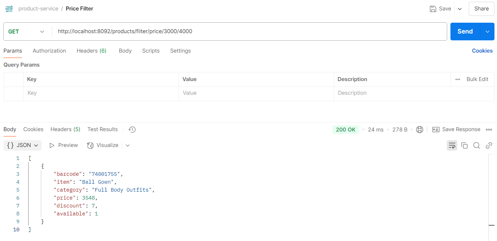
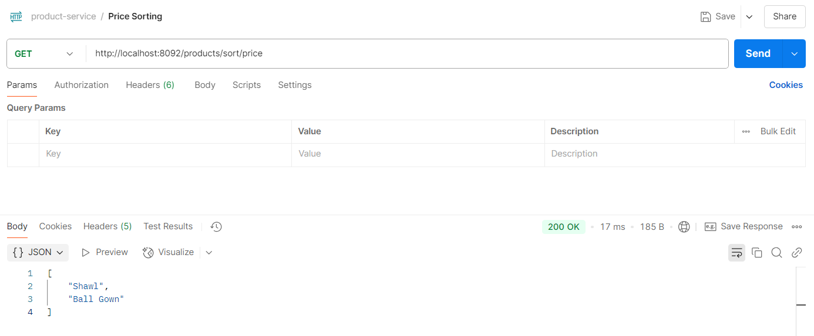
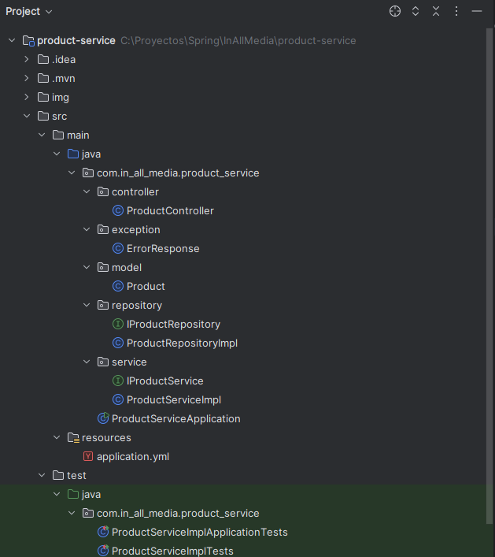
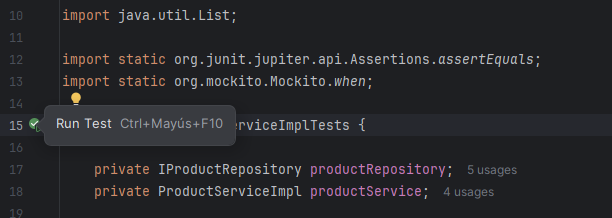
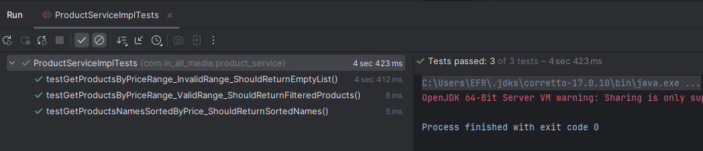

Author: Mario Efraín Moreno Cartagena  
Email: morenocartagena@outlook.com

## Technical Test - Java Developer

## 1. Solution
The product-service was developed to implement the two requested endpoints: one for filtering and 
another for sorting. The project was built using Spring Boot, Java 17, and Maven. Additionally, 
dependencies such as Lombok were included to automatically generate getters and setters, and JUnit 
along with Mockito were used for unit testing. A REST API was designed featuring the mentioned 
endpoints, and JSON was used as the data transfer format. Furthermore, the project adheres to clean 
coding practices to ensure maintainability and scalability.

## 2. Setup Instructions

a. Clone the project from GitHub
```
git clone https://github.com/morenocartagena/product-service
```

b. Configure the Port
Set the available port on your local machine in the application.yml file for the web server. The 
default port is 8092.

c. Create the project build
Use your preferred IDE or Maven to create the project build by executing the following command:
```
mvn clean install
```

d. Run the project and test the endpoints using your browser or Postman.

   Filter Endpoint: http://localhost:8092/products/filter/price/{initial_range}/{final_range}
   
   
   Sorting Endpoint: http://localhost:8092/products/sort/price
   


## 3. Technical Decision
The project is structured into different packages to separate responsibilities. Java 8 features 
like Stream API, optional parameters, or lambda expressions were considered to improve readability 
and performance. Interfaces were used to define the methods to be implemented. SLF4J was used for 
logging messages. JUnit and Mockito were also used for unit testing. Validations were added to the 
controller to check the parameters, along with a try-catch block to handle other exceptions. Below 
are the detailed descriptions of the project's packages:



# a. controller
The main class, ProductController, is defined, which contains the REST endpoints for the requested 
functionalities. One endpoint is for filtering products, and the other is for sorting products. The 
endpoints are of type GET since they only display information. For the Price Filter endpoint, Path 
Parameters were used as indicated to set the price range, where the user defines an initial range 
and a final range.

# b. model
A model was created for the products based on the specified properties. This model can be extended 
or replaced as needed.

# c. repository
An in-memory repository was created with a collection of products provided in the Technical Test. 
This repository can be extended or replaced as needed.

# d. service
The ProductServiceImpl service class was created with the two main methods: getProductsByPriceRange 
and getProductsNamesSortedByPrice, which have access to the repository and provide data to the 
controller. The repository is injected into the class constructor to facilitate testing with JUnit.
Lambda functions and Stream API were used to improve performance.

# e. exception
An ErrorResponse class is defined to handle detailed messages in the controller's HTTP responses in 
case of errors.

# f. test
The ProductServiceImplTests class is defined for unit testing with JUnit. Mockito is used to create 
a mock of the Product repository. Three tests are performed to verify the main service class, 
ProductServiceImpl. The tests are named following best practices to specify what the test does, what 
case it validates, and what the expected response is:
   - testGetProductsByPriceRange_ValidRange_ShouldReturnFilteredProducts
   - testGetProductsByPriceRange_InvalidRange_ShouldReturnEmptyList
   - testGetProductsNamesSortedByPrice_ShouldReturnSortedNames

## 4. Testing
In the IDE, simply execute the ProductServiceImplTests class or use the Run Test option. The three 
tests specified earlier are executed successfully.




